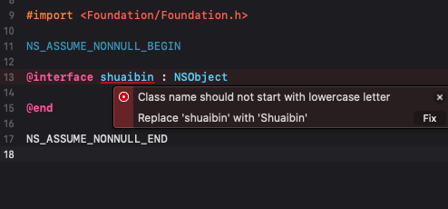

# llvm-plugin-project

## 自定义插件汇总

### [clang-checkCode](./Plugins/clang-checkCode)
>  代码规范检查插件

检测项说明:
- 检测类名是否存在小写开头
- 检测类名是否包含下划线
- 检测方法名是否存在大写开头
- 检测方法中定义的参数名称是否存在大写开头
- 检测方法实现是否超过1000行代码
- 检测属性名是否存在大写开头
- 检测属性名是否包含下划线
- 检测委托属性是否有使用weak修饰
- 检测常量名称是否存在小写开头
- 检测变量名称是否存在大写开头

效果图部分展示:

